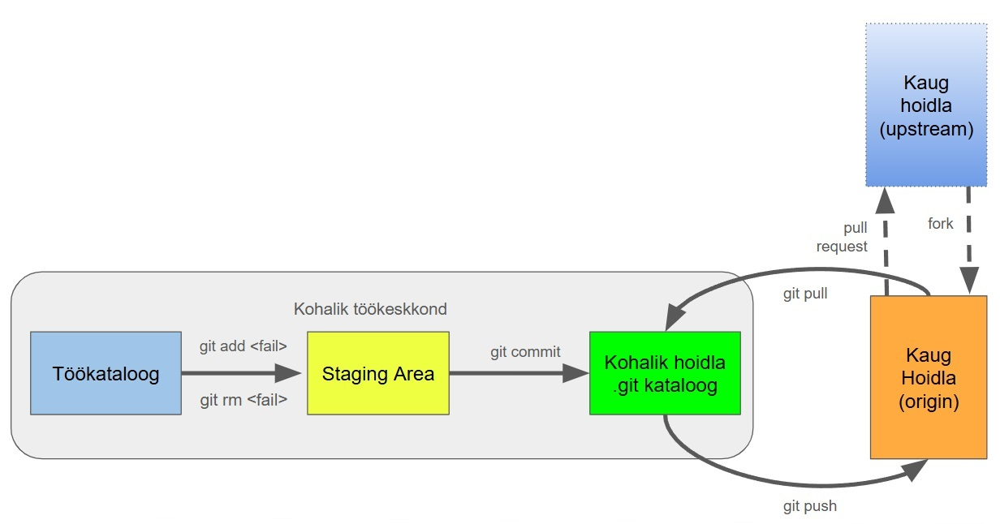

# Õppevara loomine GitHubis
See õppevara on mõeldud õpetajatele ja õppevara arendajatele, kes soovivad kasutada GitHubi õppevara (ühis)loomise ja avaldamise keskkonnana.

Vaatame üle milline on üldine töövoog GitHubi kasutamisel, millised on seotud mõisted ja kuidas see kõik võiks toimida õppevara arendamise kontekstis.

**NB!** Selle materjali loomisel on informatsiooni kogumiseks, töötlemiseks ja struktureerimiseks osaliselt kasutatud töövahendina keelemudelit ChatGPT 4o (OpenAI, 2025) seisuga märts, 2025.
Õppematerjal on redigeeritud, kontrollitud ja järeltöödeldud Tanel Toova poolt. 

## Mis on git ja mis on GitHub?
* **git** on Version Control System (versiooniohjesüsteem). See pakub:
    - Koodi ajalugu ja jälgitavust - Git salvestab kõik muudatused, mis on tehtud projektis alates selle loomisest. See võimaldab arendajatel näha, kes tegi muudatusi, millal need tehti ja miks.
    - Muudatuste tagasivõtmist - Kui midagi läheb valesti, saab tagasi pöörduda eelmise stabiilse versiooni juurde.
    - Paralleelset koostööd - Mitmed arendajad saavad samaaegselt töötada samas projektis ilma üksteise tööd segamata. Git võimaldab igal arendajal töötada oma harude (branches) kallal ja seejärel integreerida (merge) muudatused peaharu (main branch) sisse.

* **GitHub** on veebipõhine platvorm, mis pakub git versiooniohjesüsteemi põhist hoidlate majutusteenust ning palju lisafunktsioone koostööks ja projektihalduseks.
 Selle lisafunktsioonid: 
    - Vigade ja probleemid jälgimine (Issues)
    - Projektihaldus ja dokumenteerimine (Projects, Wiki)
    - Tõmbekutsed (pull requests) ja koodi läbivaatus (code review) - kaastöö lisamise ja parandamise ning heakskiitmise  vahendid projektides.
    - CI/CD (pidevintegratsioon ja pidevvalmidus) - GitHub Actions võimaldab luua reegleid ja tegevusi lisandunud koodi testimiseks ja automaatseks rakendamiseks.

## git-i ja GitHub-i üldine lihtsustatud töövoog

### 1. Koodihoidla (repositooriumi) loomine või forkimine

Esmalt on vaja koodihoidlat ehk repositooriumi (*repo*), kus õppematerjale hoida ja arendada. Kui alustad uut õppematerjali, loo see GitHubis kaughoidlana – joonisel tähistatud kui [**origin**](materjalid/8_Moistete_ja_toovahendite_selgitused.md#origin). Kui soovid täiendada kellegi teise loodud materjali, tee olemasolevast repositooriumist [**fork**](materjalid/8_Moistete_ja_toovahendite_selgitused.md#repositooriumi-forkimine) – nii saad oma koopiaga töötada iseseisvalt. Originaalne hoidla jääb sinu jaoks [**upstream**-iks](materjalid/8_Moistete_ja_toovahendite_selgitused.md#upstream) ja sinu koopia on [**origin**](materjalid/8_Moistete_ja_toovahendite_selgitused.md#origin).

### 2. Kohaliku töökeskkonna loomine

Suuremate projektide või töö jaoks ilma internetiühenduseta on soovitatav [**kloonida**](materjalid/8_Moistete_ja_toovahendite_selgitused.md#repositooriumi-kloonimine) kaughoidla oma arvutisse – seda nimetatakse [**kohalikuks hoidlaks**](materjalid/8_Moistete_ja_toovahendite_selgitused.md#kohalik-hoidla). Seal saad töötada turvaliselt ja eraldatult. Kohalikus töökeskkonnas teed muudatusi [**töökataloogis**](materjalid/8_Moistete_ja_toovahendite_selgitused.md#töökataloog), mis esindab kogu projekti aktiivset olekut sinu arvutis. Failide lisamine, muutmine või kustutamine toimub siin. Soovi korral saad kasutada Git-tööriistu, mis kuvavad ka [**staging area’t**](materjalid/8_Moistete_ja_toovahendite_selgitused.md#staging-area), kuid paljud graafilised kasutajaliidesed (nt GitHub Desktop või VS Code) haldavad seda automaatselt ja peidetult.

### 3. Töövoog muudatuste tegemisel ja salvestamisel

Muudatusi on soovitatav teha väikeste, loogiliste tükkidena (nt üks peatükk, parandused ühes failis vms). Enne kui muudatused salvestad (teed [**commit**](materjalid/8_Moistete_ja_toovahendite_selgitused.md#commit)), kontrolli, kas keegi teine on sama projekti kallal töötanud – tee [**git pull**](materjalid/8_Moistete_ja_toovahendite_selgitused.md#pull), et tuua värskeim seis kaugelt. Seejärel tee [**commit**](materjalid/8_Moistete_ja_toovahendite_selgitused.md#commit) – see salvestab sinu muudatused lokaalselt. Kui oled valmis jagama oma muudatusi teistega, tee [**git push**](materjalid/8_Moistete_ja_toovahendite_selgitused.md#push), mis saadab need GitHubi kaughoidlasse ([origin](materjalid/8_Moistete_ja_toovahendite_selgitused.md#origin)).

### 4. Koostöö harude ja Pull Request’idega

Koostööl põhineva arenduse korral tee muudatused alati [**eraldi harus** (branch)](materjalid/8_Moistete_ja_toovahendite_selgitused.md#repositooriumi-haru-branch). Näiteks kui lisad uue teema, loo haru `teema-uusosa`. Kui töö on valmis, tee sellele harus tehtud muudatustest [**push**](materjalid/8_Moistete_ja_toovahendite_selgitused.md#push) ning seejärel loo [**Pull Request** (PR)](materjalid/8_Moistete_ja_toovahendite_selgitused.md#pull-request). PR on ettepanek, et need muudatused võiks liita kas:
- sinu enda hoidla `main` [haruga](materjalid/8_Moistete_ja_toovahendite_selgitused.md#repositooriumi-haru-branch) (kui töötad iseseisvalt), või
- [**upstream**](materjalid/8_Moistete_ja_toovahendite_selgitused.md#upstream) hoidla `main` [haruga](materjalid/8_Moistete_ja_toovahendite_selgitused.md#repositooriumi-haru-branch) (kui panustad kellegi teise projekti).

## Täpsemad tegevused õppematerjali loomisel
* [Kuidas alustada?](materjalid/1_Kuidas_alustada.md) 
* [Tööülesannete loomine ja jagamine](materjalid/2_Tooulesanded_ja_suhtlus.md) 
* [Harude kasutamine](materjalid/3_Harude_kasutamine.md) 
* [Pull Requestid](materjalid/4_Pull_Requestid.md) 
* [Töö organiseerimine Projects abil](materjalid/5_Projects_too_organiseerimine.md) 
* [Materjalide testimine ja tagasiside](materjalid/6_Tagasiside_ja_testimine.md) 
* [Materjalide avaldamine ja versioonid](materjalid/7_Versioonid_ja_avaldamine.md) 

## Stiilijuhend ja vahendid sisu koostamisel  
* [Stiilijuhend](materjalid/9_Uldine_stiilijuhend_ja_töövahendid.md)
## Mõistete ja töövahendite pikemad selgitused
* [Mõisted ja töövahendid](materjalid/8_Moistete_ja_toovahendite_selgitused.md) 

## Õppematerjali koostajad

Tanel Toova (tanel.toova@tlu.ee)